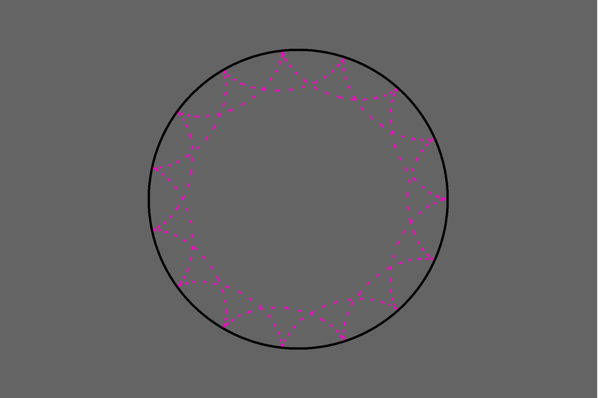

# Parametric Equations for Generative Art

P5.js is the perfect library to visualize parametric equations on the Web. Not really from Dan Shiffman's videos, but this is still an exercise to learn p5/Processing. While I am still exploring the properties of parametric equations, they have awesome potential to generate really awesome art.

## Hypotrochoid:
The first example I implementeed was of a Hypotrochoid which is simply the curve traced by a point attached to a circle moving along the cirumference of another fixed circle.

This set of equations that the describe this curve are as follow:

This is what it produces (the circle was added separately for context):

